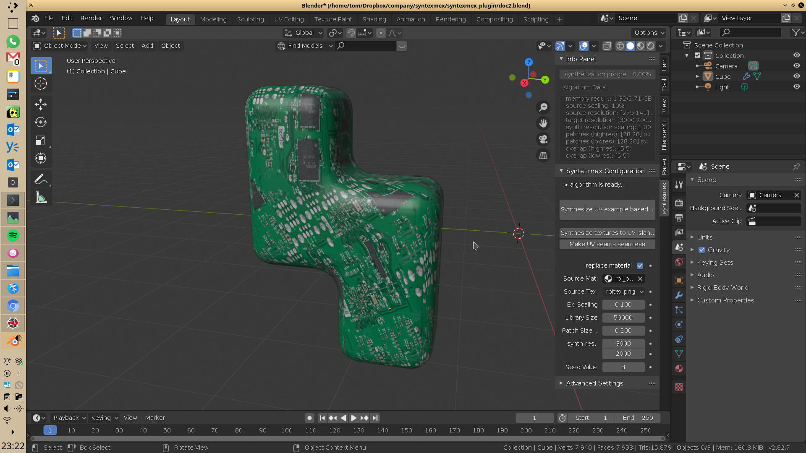
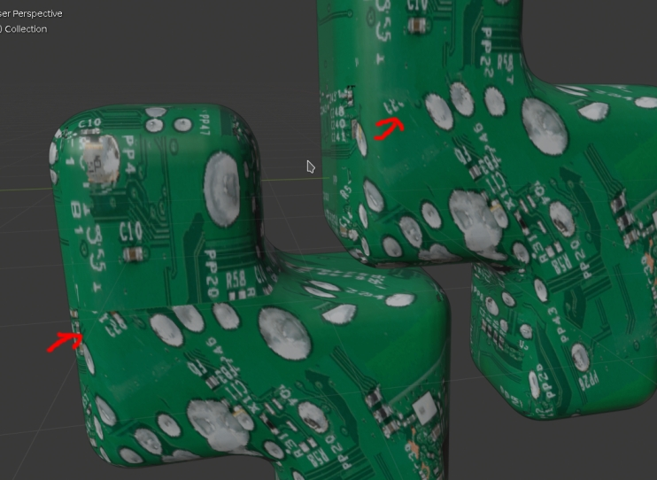
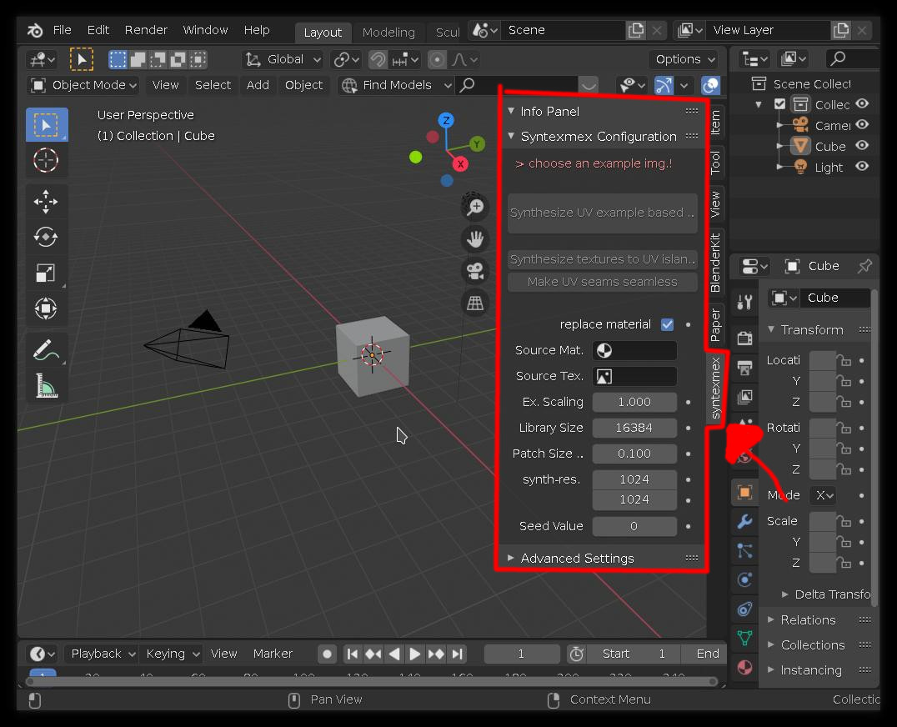
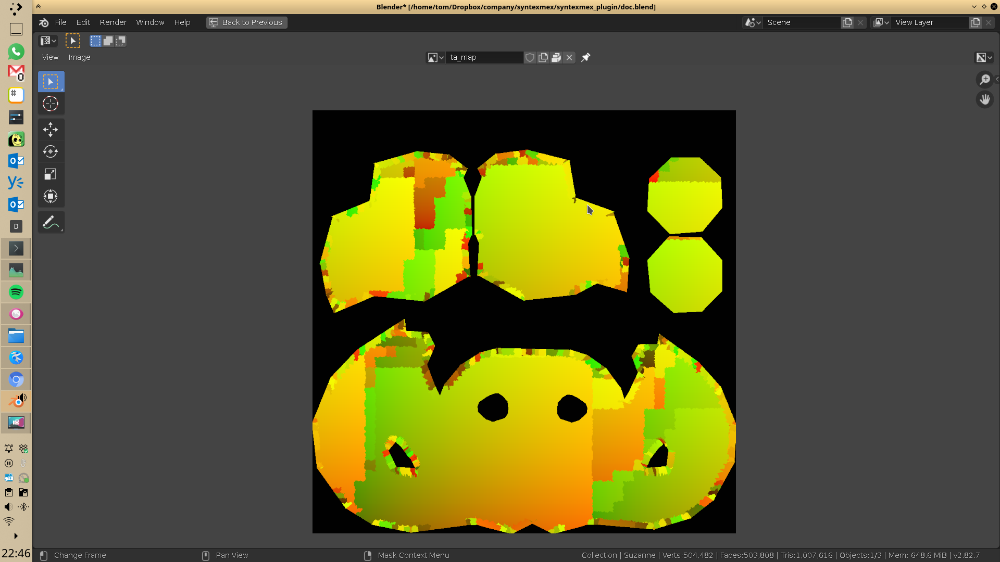
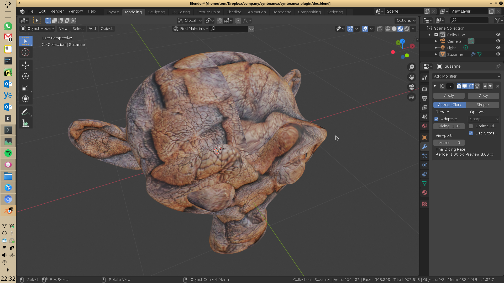
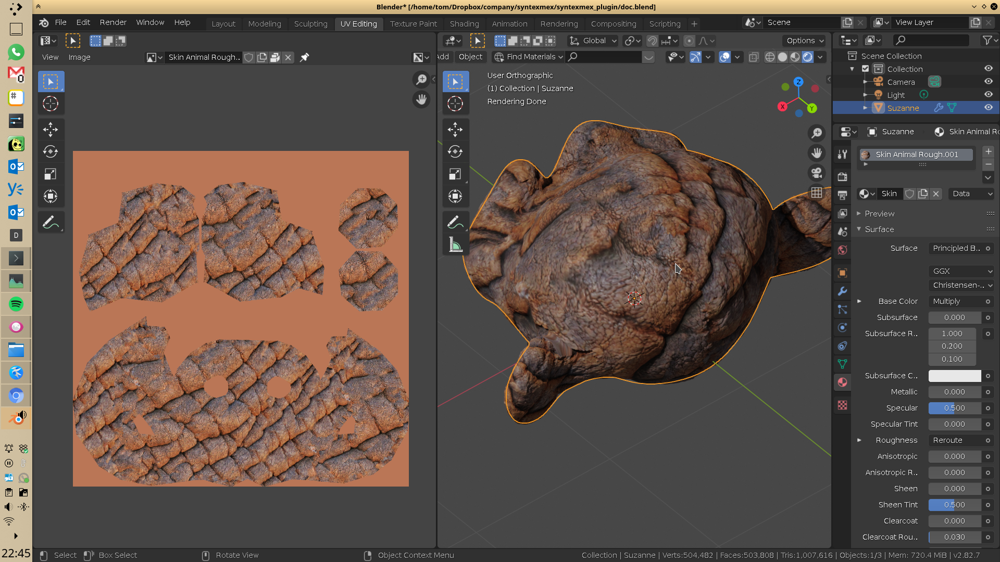
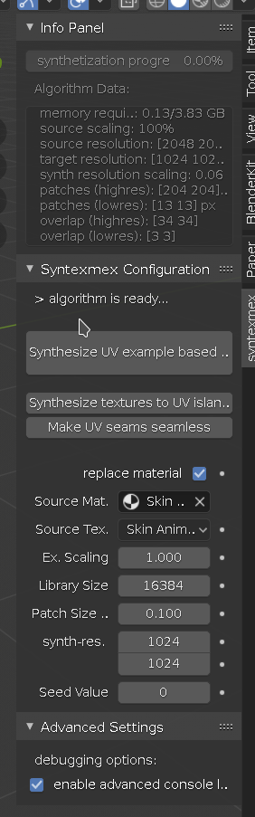

Syntexmex is an addon for blender which helps generating
UV-textures based on examples. 

taking an image like this: 

we can synthesize new texture from the example image:

or make a texture seamless, also using an example image (example
image can be the texture itself):

<!--Below is an example what
can be done with this addon:-->

<!--more-->

<!--
  
  
  
  

-->

## Installation

### Option 1:

Download the zip file from this location:

TODO: 

After downloading, open blender and go to:

    Edit -> Preferences -> Add-ons -> Install...

Choose the downloaded zip file and press

    "Install Add-on from File..."

Afterwards in Preferences, 
search for the **Syntexmex** plugin and
put a checkmark in the box to enable the addon.nn

<!--
<table>
<tr>
<td> </td>
<td></td>
</tr></table>
-->
### Option 2 (not recommended):

building the addon form source is quiet complicated as it involves 
a lot of 3rd party libraries.

These are:

skimage, shapely, pynndescent, Pillow, decorator, sklearn, scipy, numba, 
networkx, PIL, llvmlite

after the add-on directory has been copied into
the blender addons directory (TODO; where?),
these libraries have to be copied into a "lib/" directory
inside of the blender plugin.

## How to Use the Add-on

### Where to find it

The Addon can be accessed through the properties sidebar in
3D View (Access with shortcut key: 'N') in a the *syntexmex* tab

### Quick introduction

<!--
In this tutorial, we chose this material here, 
but you are free to choose any material
you want. As long as it involves 
image-textures this algorithm will
work:

https://www.blenderkit.com/get-blenderkit/bd05e68d-9775-43dc-9b65-9fda1aa8e37a/

With Suzanne, you will get a alrady unwrapped UV model
-->

quick explanation:

- the plugin takes a copy of an existing material.
- it generates a new image texture on UV islands
  based on the selected images in the material.
- it makes that image texture seamless.
- it creates a *synthmap* which gets used to synthesize all other
  images in the textures the exact same way.
- it replaces the other images afterwards

Example of a generated synthmap for Suzanne. You can xsee the generated patches
at the borders of the UV islands. The synthmap also helps for debugging and
finding the right parameters for the texture:

Example of Suzanne *before* making edges seamless and *after*:

### Operations

**Synthesize UV example based texture**
: Synthesize textures for UV islands and make edges between them seamless.

**Synthesize textures to UV islands**
: Only synthesize texture for each UV island without making edges seamless.

**Make UV seams seamless**
: Make edges between UV islands seamless.

### Parameters

**source material**
: Choose the source material which should get used for synthesizing
  a new material without seems on a given UV map

**source texture**
: choose one of the textures within the material as the basis for
  the synthesis

**ex. scaling**
: the example texture can be scaled up /down by a factor. Use this
  if you want to achieve a different scaling of the example texture
  in the final result.

**library size**
: This controls the quality of the algorithm. It defines the size of
  the search-index that the algorithm builds. Higher values will
  need more calculation time and memory. The quality is limited
  by the amount of available memory on your system. Normally values
  up to 100000 should not be a problem for most systems (~1-2GB).

**patch size ratio**
: The algorithm stitches together patches from the original example
  image. The size of the patches in relation to the example image
  can be controlled with this parameter. Larger sizes tend to
  improve the quality (although not always) and the coherence
  of the final result.

**synth-res**
: The resolution of the target texture. The higher this value
  the "smaller" synthesized features will become and vice versa.

**seed value**
: The algorithm makes use of some random internal parameters
  this value enables an option to get different versions of a 
  synthesized texture

### Advanced Settings

**debugging options**
: Turn detailed debugging in console on/off.

## Some hints

- usually its a good idea to first make a test run with a low value
  for library size to get a quick preview of what it might look like
  then once you are satisfied with the patch size, example scaling etc...
  turn library size up to the maximum value possible with the
  available memory.

- make Sure to unwrap the UVs of your model. You will want
  to make sure that there are no overlapping UVs. The same rules apply here
  as for every other UV-unwrapping process. Good results can be achieved
  when UVs aren't too warped, and areas of UV faces correspond to the actual
  face areas. Also there should be a little gap of at least a couple pixels
  between each UV island to prevent textures from bleeding into
  other uv faces.

- make sure when using "subdivision modifier" to put Options on "Sharp",
  because otherwise seams are going to be visible again due to the smoothing
  of UV coordinates

- increase patch size for better adherence to the patterns found
  in the example image

  
- alorithm automatically iterates over the longer of two edges and
  writes pixels from there into the face of the shorter edge
